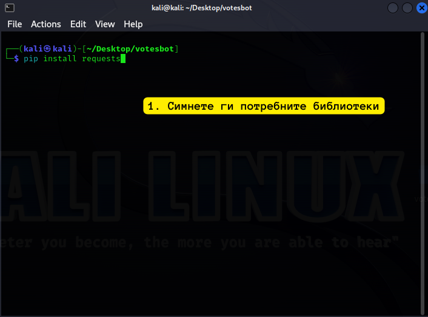
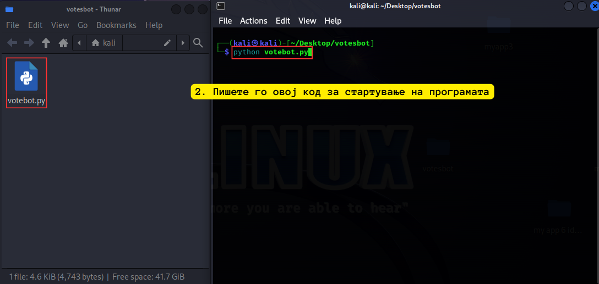
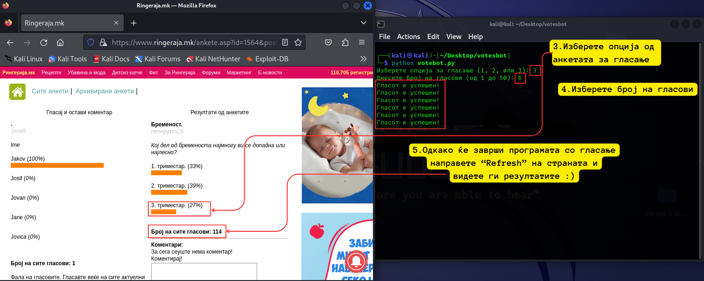

# ringeraja.mk Бот за гласање на анкети

Оваа апликација го автоматизира процесот на гласање на анкети

## Како се користи?

1. **Клонирајте го проектов:** Клонирајте го овој проект на вашата локална машина користејќи ја следнава команда:
```
git clone https://github.com/l3069/ringeraja.mk-VoteBot.git
```
2. **Инсталирајте Python:** Проверете дали имате инсталирано Python 3.x на вашиот систем. Можете да го преземете од официјалната веб-страница на Python: https://www.python.org/downloads/

# Код инсталации:

```shell
pip install requests
```

1. Стартувајте ја апликацијата: започнете ја скриптата votebot.py користејќи Python:
```
python votebot.py
```
2. Изберете број на полето на анкетата каде што сакате да гласа ботот (1-3)

3. Внесете број на гласови (1-50) и кликнете "Enter" за да го започнете процесот на ботот.

## Сликовит приказ за употреба:




### Автор
Автор на овој проект е: Леонид Крстевски

### Важно!
Оваа апликација е наменета само за едукативни и легитимни цели за тестирање. Не треба да се користи за какви било неовластени или нелегални активности, провокации или сајбер напади. Авторот на оваа апликација не е одговорен за каква било злоупотреба на оваа скрипта.

#### Warning: This project is not intended for any cyber disruption or illegal purposes. The author is not responsible for any misuse of this code.
